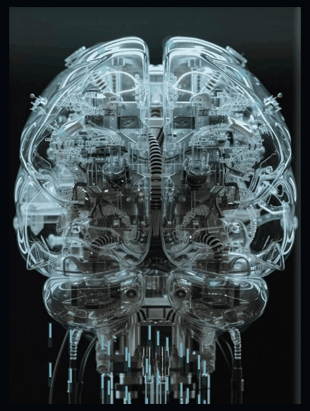

  

## Merhaba

Adli tıp alanında araştırma görevlisiyim. Ankara Bilkent Şehir Hastanesi Adli Tıp
Kliniği'nde çalışıyor, Hacettepe Üniversitesi Yazılım Mühendisliği Yüksek Lisans
Programı'nda öğrenim görüyorum.

Adli tıp ile yazılım mühendisliğinin kesiştiği alanda çalışıyorum. İlgi alanım,
adli tıbbın soruları ile hesaplamalı yöntemlerin bir araya geldiği yer: epigenetik
verinin adli bağlamda değerlendirilmesi, adli toksikolojide veri çözümlemesi ve
laboratuvar süreçlerinin yazılımla desteklenmesi.

## İlgi alanları

`adli tıp` · `adli toksikoloji` · `epigenetik` · `DNA metilasyonu` ·
`biyoinformatik` · `veri çözümlemesi` · `Python`

## Depolar

Çalışmalarıma ilişkin kod havuzları şu an özel durumdadır. Yayımlanan makalelerde
kaynak gösterilen havuzlar, ilgili yayın süreçleri tamamlandığında erişime
açılacaktır.

---

Ankara Bilkent Şehir Hastanesi · Adli Tıp Kliniği 
Hacettepe Üniversitesi · Yazılım Mühendisliği Yüksek Lisans 
<a href="https://orcid.org/0009-0004-2874-4594">ORCID 0009-0004-2874-4594</a>

